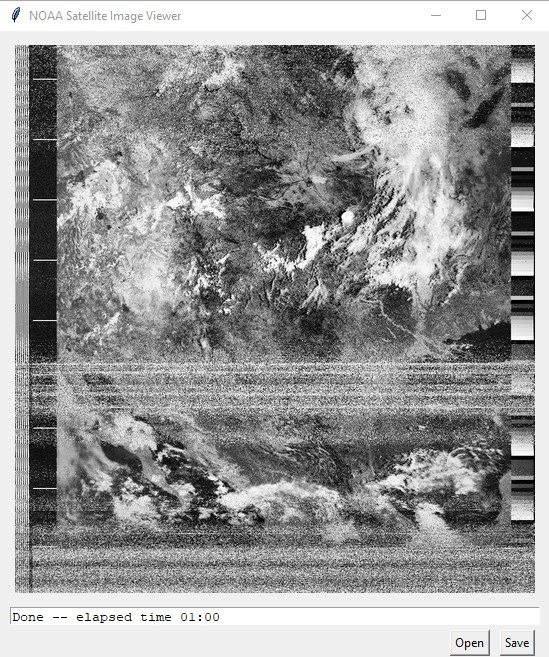

# NOAA APT Decoder Application

MVP for an application to translate raw data files recorded from NOAA satellites
to JPG images.


NOAA image captured from satellite by Raven Redfox

Decoder code is adapted from [https://github.com/zacstewart/apt-decoder](https://github.com/zacstewart/apt-decoder), under MIT license

### Intallation and running

To install just the executable (for Windows):

1) download the noaa.zip file
2) unzip to the location of your convenience
3) go into the noaa folder
3) run decode.exe

For Mac, TBD

Or to install project:

1) Download or clone this project
2) create virtual environment, e.g.
```
conda create -n noaa_decoder python
conda activate noaa_decoder
```
3) Install dependencies
```
pip install -r requirements.txt
pip install -e noaa_apt
```
4) run
```
python decode.py
```

### Use:

1) Open application (decode.exe or decode.py)
2) Click 'Open' button
3) Select WAV file for image and <OK>. Program will decode the image and display.
4) Save the image


